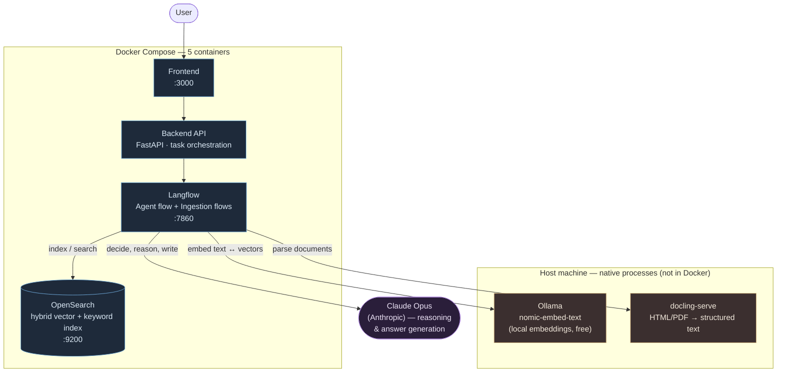
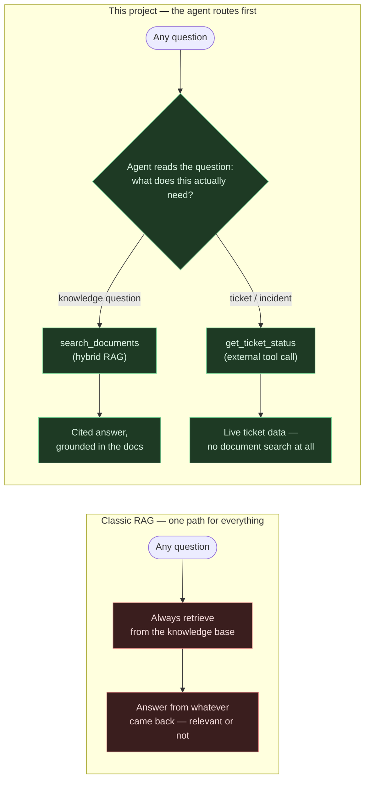

<div align="center">


# openrag-twin

<h3><em>A functional replica of IBM's OpenRAG, built to prove I understand the stack — not just describe it</em></h3>

</div>

---

## Pitch video

<video src="https://raw.githubusercontent.com/valentinleconte/openrag-twin/main/communication/openrag-twin-tech-pitch.mp4" controls muted width="100%"></video>

A ~3-minute walkthrough of what this project is, the architecture, the routing scenario, and one
real bug found and fixed along the way. If the embed above doesn't load for you, the same file is
directly available in [`communication/`](communication/).

---

## Why this exists

I'm preparing for a **Field/Client Engineer** interview at IBM. Instead of reading about
[OpenRAG](https://github.com/langflow-ai/openrag) — IBM's agentic RAG product built on
**Langflow + Docling + OpenSearch** — I cloned the real, open-source project, ran the actual
stack, broke it, fixed it, and extended it with a functional scenario of my own.

This repo is **not** a from-scratch reimplementation. It's the genuine upstream codebase
(Apache 2.0), with my own additions layered on top:

- A working local install, running fully on this machine (Docker + native services)
- A **document corpus** ingested from the real OpenSearch documentation
- A custom **agent tool** and **routing logic** on top of the stock RAG flow
- Five real bugs hit and fixed along the way — documented with root cause, not just "it works now"

If you're wondering why the commit history and contributor list look like upstream's: that's
because they are. I built on top of it deliberately, the way you'd extend a product at work
rather than re-invent it. My own commits are on top — see `git log` from `docs(CLAUDE.md)` onward,
or the [full engineering log](CLAUDE.md).

## What I'm demonstrating

The brief I gave myself: **prove the "agentic" half of agentic RAG, not just the "RAG" half.**

Most RAG demos show retrieval-then-generation and stop there. That's necessary but it's not what
makes OpenRAG interesting — the interesting part is a system that **decides what to do** before
it acts. So the scenario is a support agent that has to choose between two entirely different
behaviors depending on what's actually being asked:

| Question type | Example | What the agent must do |
|---|---|---|
| Knowledge question | *"What is hybrid search in OpenSearch?"* | Search the indexed docs, answer **only** from retrieved chunks, **cite the source page** |
| Support request | *"What's the status of ticket #101?"* | Skip the docs entirely, call an external tool, return live data |

Nothing routes these by keyword-matching or a regex `if "ticket" in message`. The routing is the
LLM reading its own tool descriptions and deciding — the same mechanism a production agent would
use to pick between a knowledge base, a CRM, a ticketing system, or a calculator.

## Architecture



Each piece has one job:

- **Docling** — turns messy real-world documents (HTML pages, PDFs) into clean, structured text.
- **OpenSearch** — stores document chunks and their vector embeddings; answers hybrid
  (semantic + keyword) search queries in milliseconds.
- **Langflow** — the orchestration layer: defines the ingestion pipeline and the agent's flow as
  a graph of components, each swappable.
- **Ollama** — runs the embedding model *locally*, so ingestion has no per-token cost and no
  external dependency for the vectorization step.
- **Claude (Anthropic)** — the model that does the actual reasoning: routing decisions, tool-call
  arguments, and final answer composition.

## The value-add over "classic" RAG



A classic RAG pipeline retrieves for *every* question, because retrieval is the only tool it has.
Ask it about a support ticket and it will dutifully search the documentation, find nothing
relevant, and either hallucinate an answer or awkwardly say "I don't know" — because it was never
given the option to do anything else.

This agent has **two tools and a decision to make**. A ticket question never touches the document
index. A knowledge question never touches the mock ticketing system. The routing itself — not the
retrieval — is the thing being demonstrated.

## Try it

```bash
make twin-up
```

One command, ~2 minutes, brings up Ollama, docling-serve, the 5 Docker containers, re-applies the
Langflow configuration, and **runs a smoke test** (one knowledge question, one ticket question)
before declaring success. Tested cold — see [`scripts/twin/up.sh`](scripts/twin/up.sh).

Then open **http://localhost:3000** and try:

- *"How do I ingest data into OpenSearch?"* → cited answer from the docs
- *"What's the status of ticket #101?"* → `Open / High priority / Alice Martin` (mock data, see below)
- *"What's the status of ticket #999, and what is an index?"* → both tools called, both answered

## What's mine vs. upstream

| Path | What it is |
|---|---|
| [`opensearch-docs-md/`](opensearch-docs-md/) | The ingested corpus — 11 pages of real OpenSearch docs, fetched and converted to Markdown |
| [`scripts/twin/ticket_status_component.py`](scripts/twin/ticket_status_component.py) | Custom Langflow tool: mock ticket-status lookup, wired into the agent |
| [`flows/openrag_agent.json`](flows/openrag_agent.json) | The stock agent flow, extended: the tool above + a rewritten routing/citation system prompt |
| [`scripts/twin/up.sh`](scripts/twin/up.sh), [`sync_langflow_vars.py`](scripts/twin/sync_langflow_vars.py) | One-command, self-validating, self-healing startup |
| [`CLAUDE.md`](CLAUDE.md) | Full engineering log: every bug, root cause, and fix |
| everything else | Upstream [langflow-ai/openrag](https://github.com/langflow-ai/openrag), Apache 2.0 |

## Bugs found & fixed

Five, ranging from cosmetic to genuinely instructive. The one worth reading if you only read one:

> **Version-skew in serialized components** — Langflow flows embed each component's *Python source
> code* directly in their JSON. The bundled flows were exported from a newer Langflow version than
> the one actually installed, so components called functions that didn't exist yet in the running
> package (`ModuleNotFoundError`) — and it stayed invisible until the components actually
> *executed*, not just loaded. Serializing application code into a config file creates a hidden,
> hard-to-test coupling between the config and the engine version. Fixed by swapping each broken
> component's code for the version actually installed in the container.

Full writeup with all five (Fernet key formatting, a disabled security default blocking
onboarding, a broken-but-harmless healthcheck, and the one above hitting two components) in
[CLAUDE.md](CLAUDE.md).

## License

Apache 2.0, same as upstream. See [LICENSE](LICENSE).
